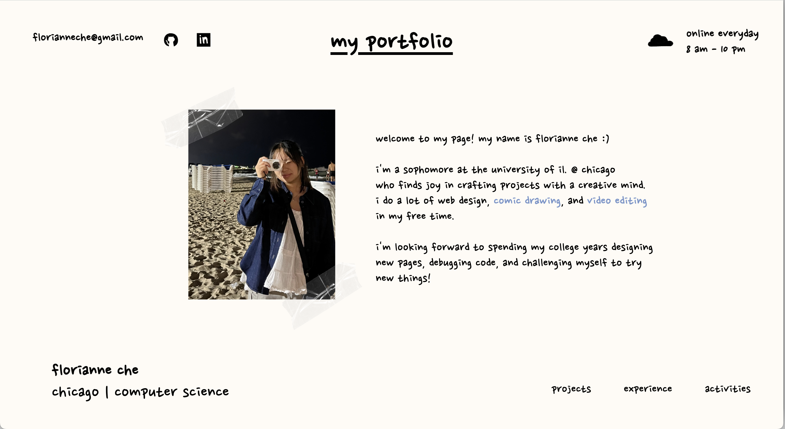

# Personal-Website
A website directory of my projects, experience, and activities. I spent the summer teaching myself how to develop with HTML/CSS/JS and jQuery to build a fun website that would showcase my interests. You'll be able to view more information about me as a student, current projects I'm involved in, and also past work experiences. This process took about 2-3 days of designing on Figma and a month of development.

### 
